## Digital circuit design pipeline

### Synthesis

We use Design Vision, and automate the synthesis by running the script:

```bash
dc_shell-t -f dc.tcl | tee log&
```

### Layout 

```bash
velocity -log encounter -overwrite
```

> Video tutorial: <https://www.youtube.com/watch?v=jEsLRqFlW8k>
>

> *Note:* 
>
> - Pay attention to all the warnings and errors in the terminal!*
>
> - Remember to save the design after every step. It’s helpful to maintain a good project architecture as follows:
>

```
.
├── inputs_files: contains design inputs like post synthesis netlist, .sdf, .sdc, .lib, StreamOut.map (used for exporting GDS), Clock.ctstch (used for setting clock tree)
├── export_files: for saving post-layout netlist (.v) and GDS file
├── io: for saving PIN location file
├── reports: for saving all the reports(area,timing, clock, ...)
├── temp: folders for saving intermediate steps, eg., 1_save_import, 2_save_floorplan, 3_save_powerplan, 4_save_placeroute, 5_save_clocktree, 6_save_route, 7_checked, 8_finalized. 
```

- There is no need to follow exactly as the screenshot. But make sure the design has a
  large margin and tick the options that make the design safe (like timing-driven
  mode in the nano-routing). 

#### Encounter routing Procedure

1. **Import design**

- Synthesized gate level netlist (.v)

- LEF file (.lef): csm18ic_6lm.lef, csm18ic_6lm_antenna.lef

- IO file (.io) : this file can be obtained after assigning the IO position in step 4.

<p align="center">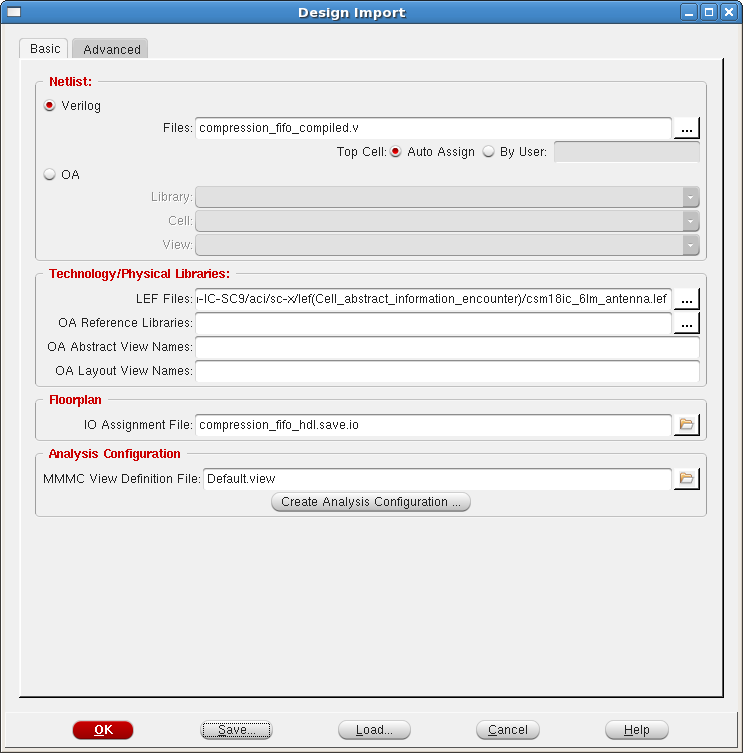</p>

<p align="center"></p>

**MMMC view: this step is error prone! Please watch the video to understand the procedures.** 

<p align="center">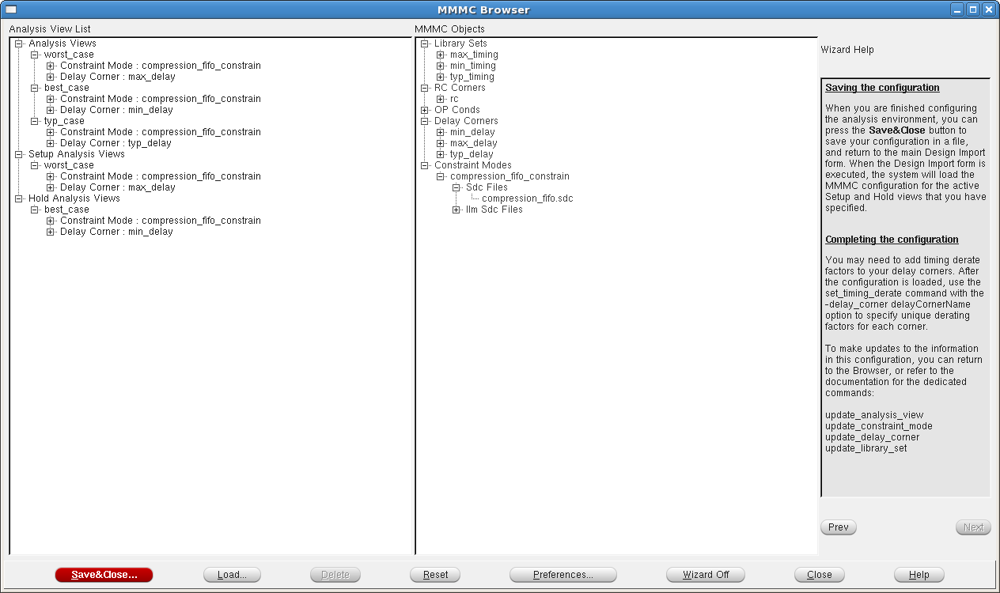</p>

- Library sets: 
  - Max_timing: csm18ic_ss.lib 
  	- Min_timing: csm18ic_ff.lib
  	- Typ_timing: csm18ic_tt.lib
  - Delay corners
    - Min_delay: min_timing
    - Max_delay: max_timing
    - Typ_timing: typ_timing
  - Constrain model: .sdc 
  - Analysis view: 
    - Worst case: max_delay
    - Best case: best_delay
    - Setup analysis: worst_case
    - Hold analysis: best_case
  - Set hold time: Option->set mode->mode setup->optimization tab->hold slack=0.7

<p align="center">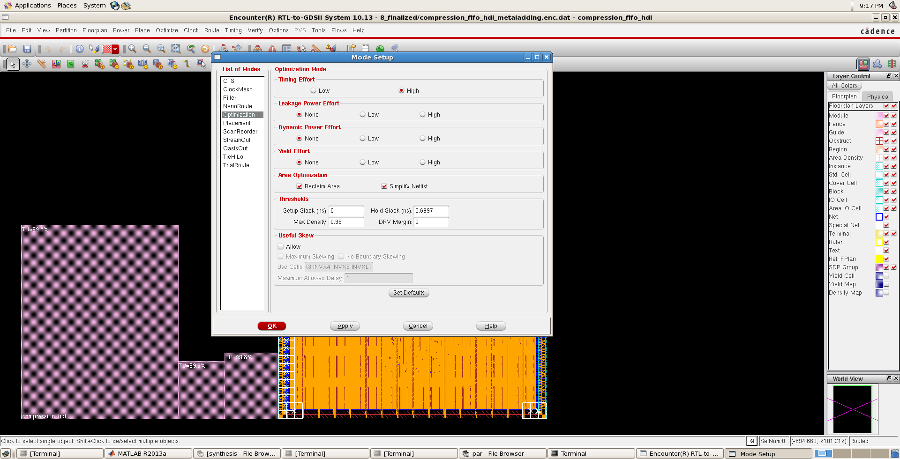</p>

2. **Floorplan**: previously set to be 1600*2000, which seems too large. 50% of this size is
   proper in this round of tape-out.

<p align="center">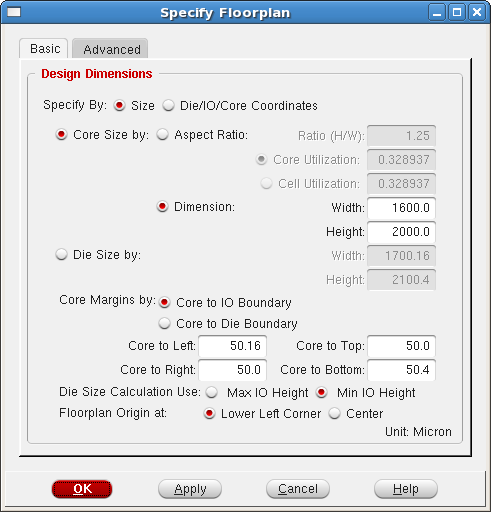</p>

3. **Power planning**: 
   - Connect global nets: VDD, VSS, mode set: TIEHI,TIELO

<p align="center"></p>

<p align="center">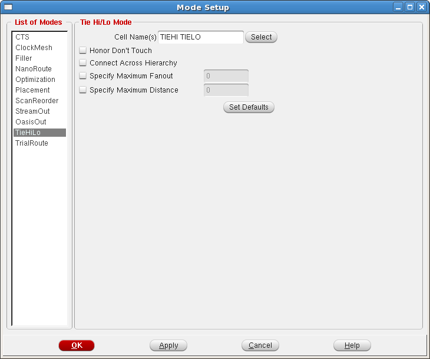</p>

   - Add power ring and strip: VDD, VSS

<p align="center">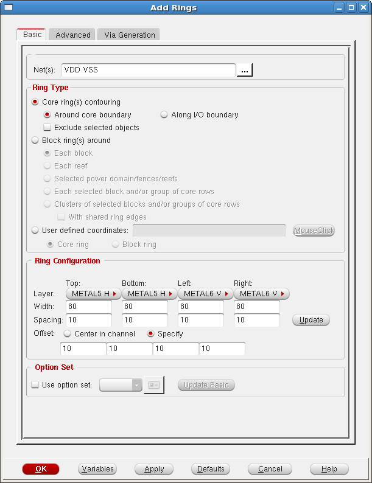</p>

<p align="center"></p>

   - Special route:

<p align="center"></p>

4. **Placement**
- Place standard cells (timing-driven mode)

<p align="center">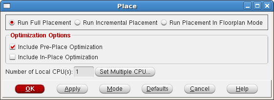</p>

   - PIN designer (after this step the pin positions can be exported to .io file)

<p align="center">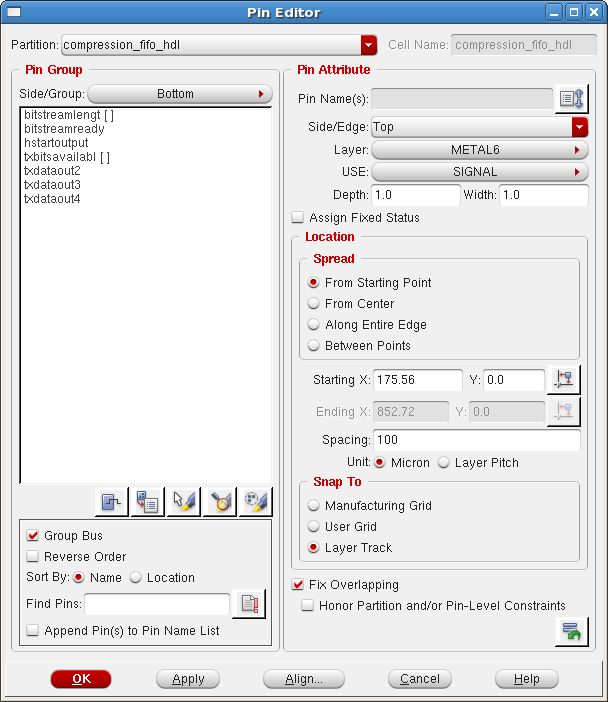</p>

The IO assignment of the last tape-out is as follows. For convenience, it’s better to follow the same position. (Some of the IO may be missing in this design comparing to the last design.)

<p align="center"></p>

   - Optimize design: time->optimize: pre-CTS

<p align="center">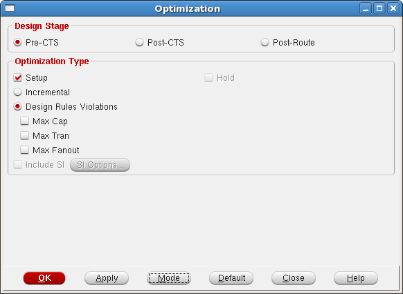</p>

5. **Clock tree synthesis** (import the clock.ctstch in the attachement)

<p align="center">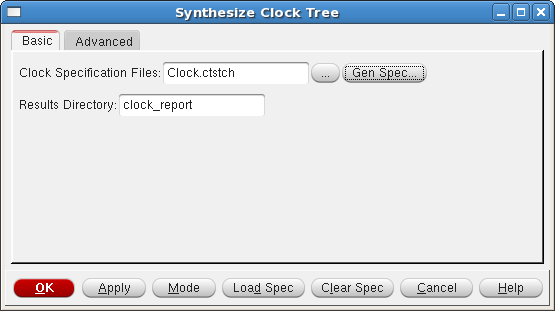</p>

<p align="center"></p>
- Post-CTS optimization
- Check geometry; check timing
- Save to "-CTS.enc"
- 
<p align="center"></p>

6. **Nanoroute**: timing driven and optimize via&wire

<p align="center"></p>

7. **Optimization** (before is OK! Except io)

<p align="center"></p>

- Check timing (for both setup and hold)

<p align="center"></p>

- Save to "-routed.enc"

8. **Place fillers** (add dummy cells in the vacant locations to increase the physical strength of the chip)

<p align="center">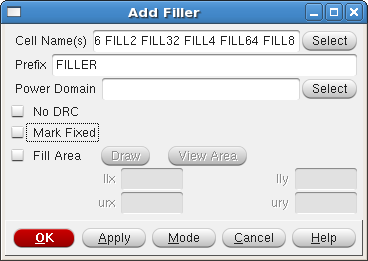</p>

9. **Verify the layout** and report generation

<p align="center">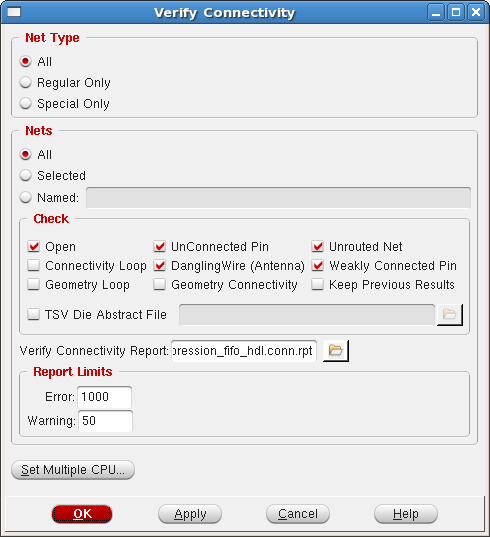</p>

<p align="center">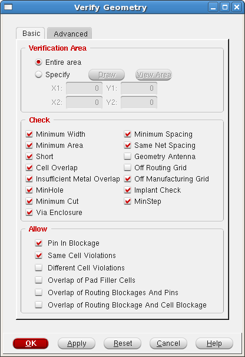</p>

<p align="center"></p>

- Verify annena
- And Violance report
- Save to "-checked.enc"

10. **Optimizations**

    o   Cell and metal fill

    o   Save "-finalized.enc"

11. **Export GDS & SDF**

- Change RC extraction mode, Extract RC and save to sdf

  <p align="center"></p>

- calculate delay

<p align="center">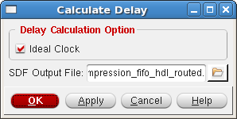</p>

- Netlist

<p align="center">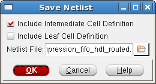</p>

- Gate report

<p align="center">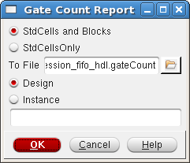</p>

- Report summary

<p align="center"></p>

- Report_timing: GDS should be merged with library

<p align="center"></p>

12. Do the post-layout simulation with the netlist and the extracted RC delay (SDF file). The simulation procedure is the same as the post-synthesis simulation: back-annotate the testbench with the new SDF file.


### Export layout design from Encounter to Virtuoso

1. import verilog file
- create a new library attached to technology library

2. import GDS file: technology library & layer map (**Do not include digital library Label VDD! & VSS!**)

<p align="center"></p>

<p align="center">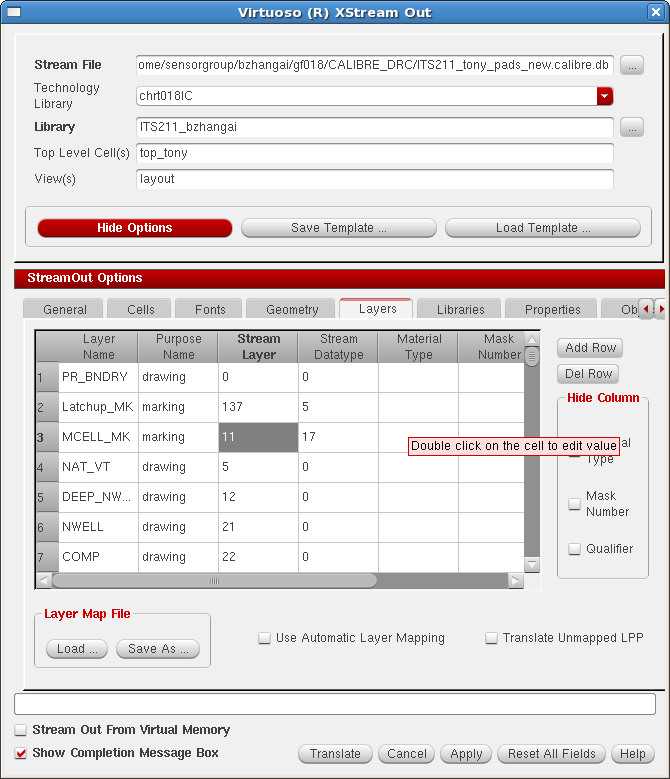</p>

3. check LVS&DRC (Should modify LVS rule as follows)

<p align="center"></p>

4. merge layout and connect with the pads
   - Change option: resolution
   - Link schematic
   - DRC and LVS with the pads
   - **NOTE: when wiring the layout with the pad, use the draw layer not the label layer to draw the line. Otherwise, the chip will fail without any warnings!**

<p align="center">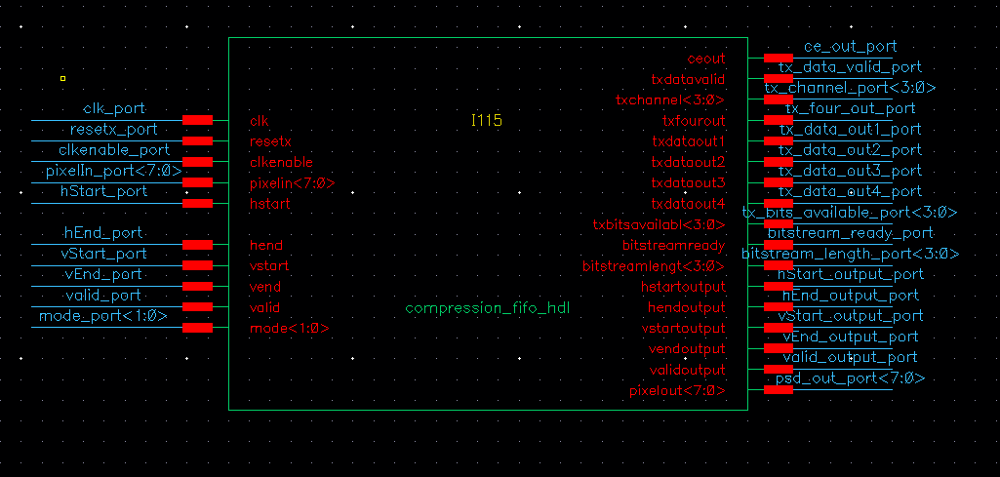</p>


### To be continued… (transistor level simulation)